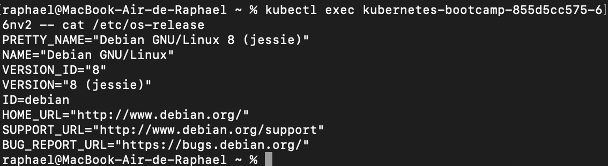

### ECE-DEVOPS / Lab 7 

## 1. Install Minikube

[Install Minikube](https://kubernetes.io/docs/tasks/tools/install-minikube/) following the instructions depending on your OS.

On demarre un session minikube en ayant lancer docker avant 

```
minikube start
```

Verify that everything is OK with:
```
minikube status
```

## 2. Learn to use `kubectl` commands

1. Open a terminal

2. Run a `deployment` with one `pod` with the following command:
   ```
   kubectl create deployment kubernetes-bootcamp --image=gcr.io/google-samples/kubernetes-bootcamp:v1
   ```
   `gcr.io/google-samples/kubernetes-bootcamp:v1` is a Docker image of a basic Node.js web application.
   
3. List all the running pods with:
   ```
   kubectl get pods
   ```
on stock le nom du running pods : kubernetes-bootcamp-855d5cc575-66nv2

4. Display the pod logs with:
   ```
   kubectl logs $kubernetes-bootcamp-855d5cc575-66nv2
   ```
   
5. Run a command inside the pod with:
   ```
   kubectl exec kubernetes-bootcamp-855d5cc575-66nv2 -- cat /etc/os-release
   ```



6. Open a shell inside the pod with:
   ```
    kubectl exec -ti kubernetes-bootcamp-855d5cc575-66nv2 bash
   ```
   on se retrouve avec une ligne commancant par : ```root@kubernetes-bootcamp-855d5cc575-66nv2:/# ```

7. List the content of the directory you are in and try to find the JavaScript source code file

On rajoute donc 'ls' à la ligne
```root@kubernetes-bootcamp-855d5cc575-66nv2:/# ```

8. Make sure that the web app is responding inside the container by querying it with `curl`

   > **Hint.** The port on which the app responds is defined in the `/server.js` JavaScript file

   On va tout d'abord chercher sur qul port notre application marche :

   ```root@kubernetes-bootcamp-855d5cc575-66nv2:/# cat /server.js```

   Puis 
   ```localhost://8080``

   ce qui donne comme réponse: 
   ``` 
   Hello Kubernetes bootcamp! | Running on: kubernetes-bootcamp-855d5cc575-66nv2 | v=1
   ```
   
9. Are you able to query the web app outside of the pod (from your local machine)?

on effectue la même commande mais cette fois en dehors du pod:
```raphael@MacBook-Air-de-Raphael ~ % curl http://localhost:8080```

Et on obtient cette fois une erreur :

```
curl: (7) Failed to connect to localhost port 8080 after 6 ms: Couldn't connect to server
```